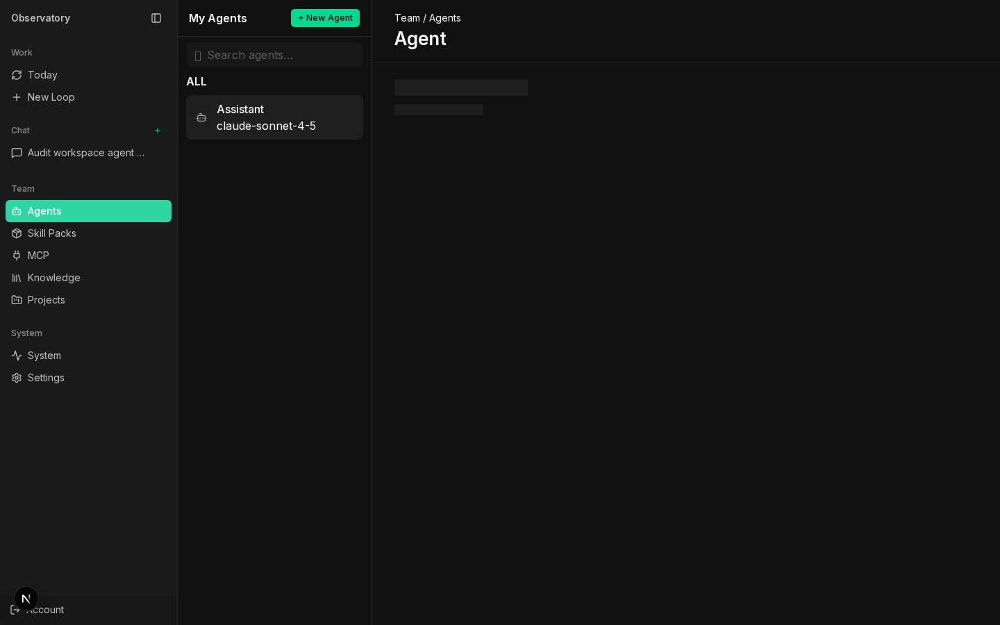
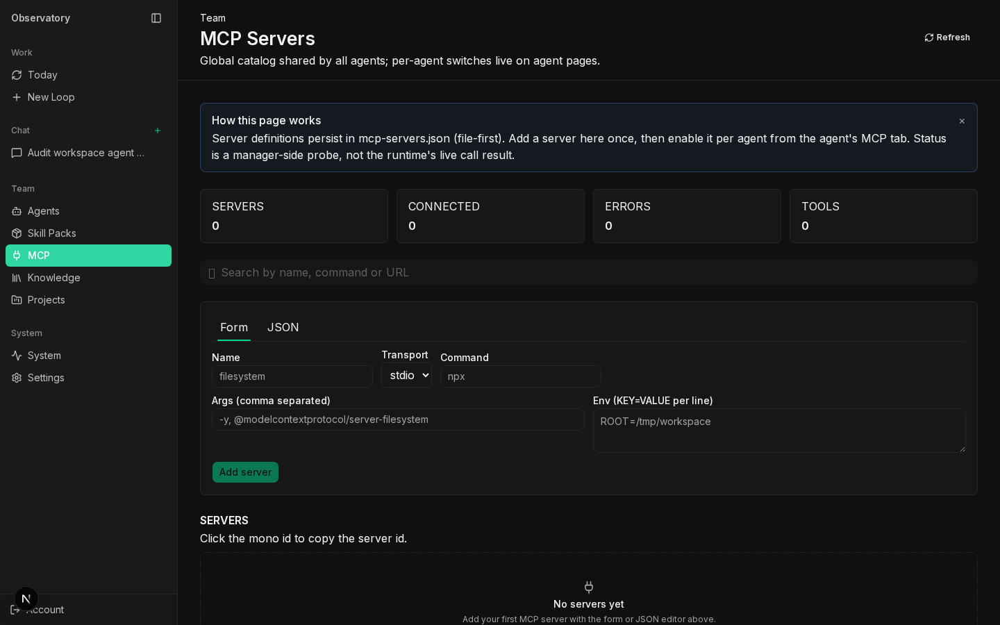
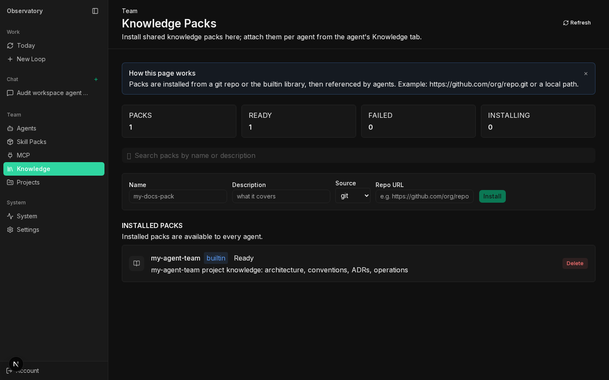
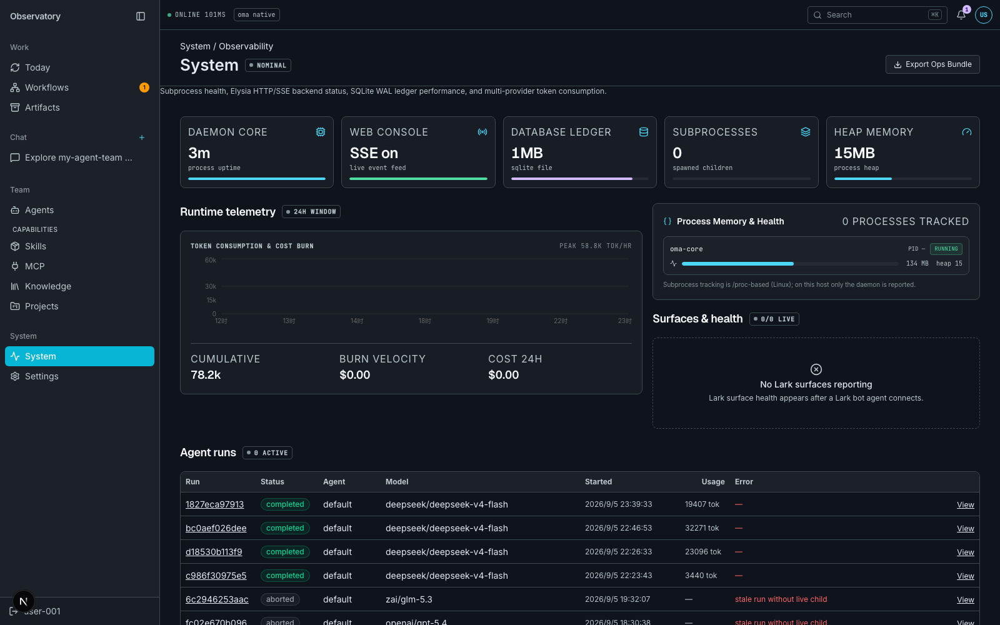
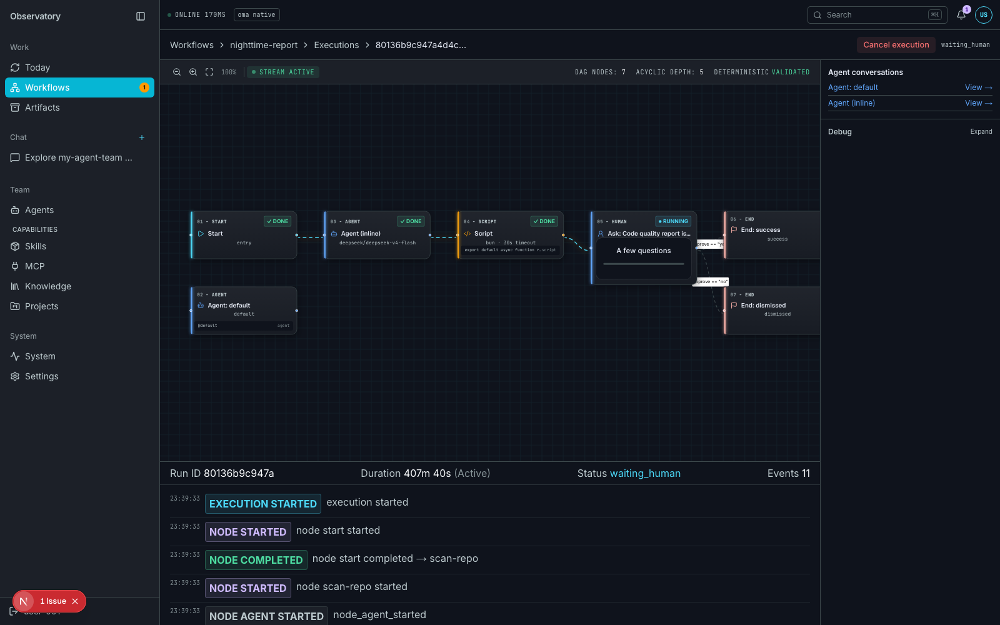
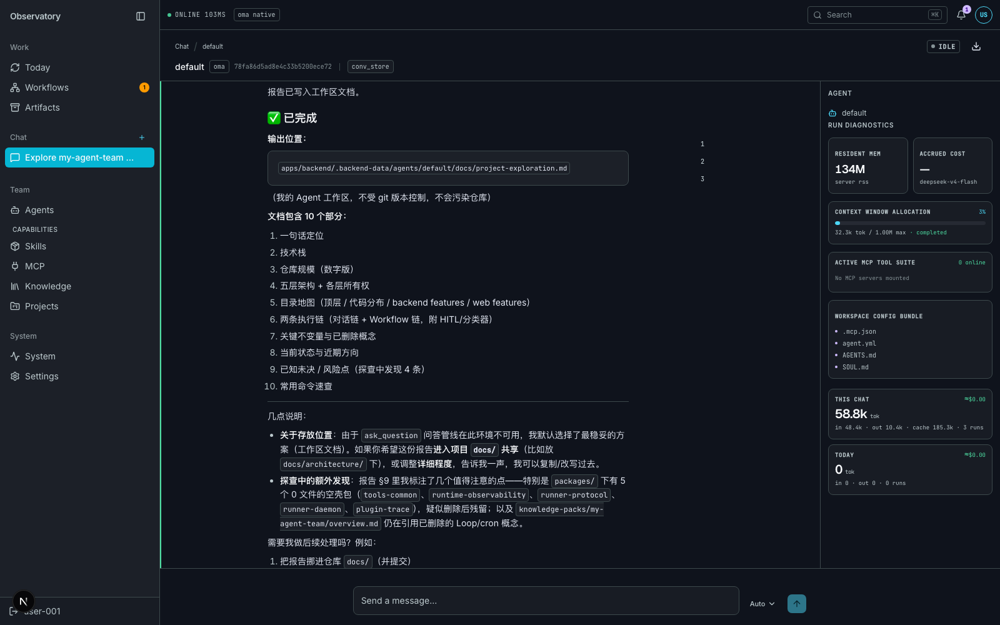
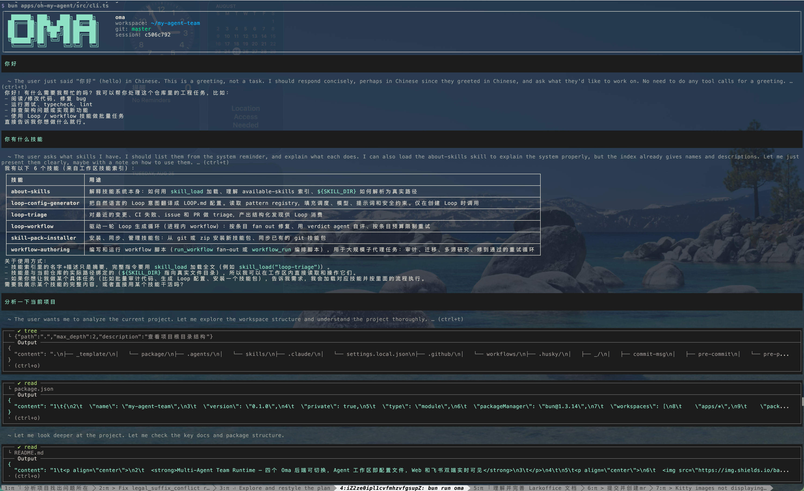
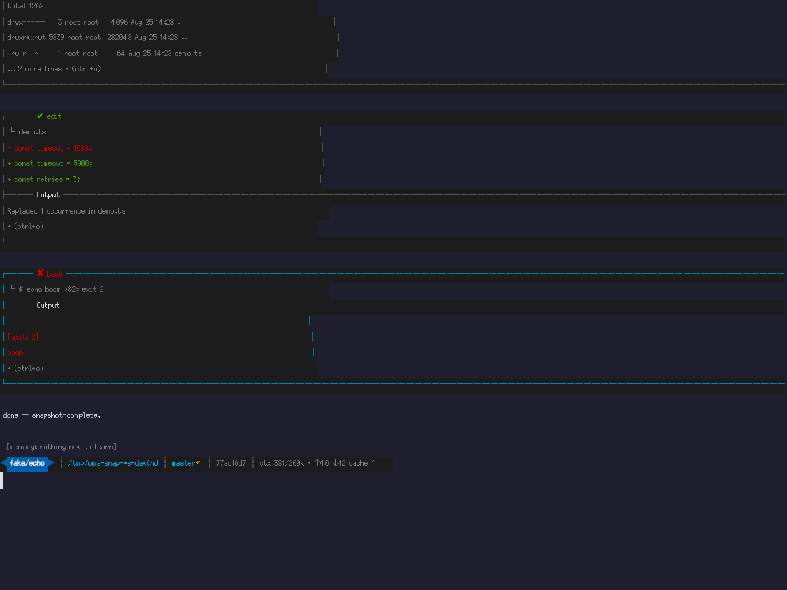
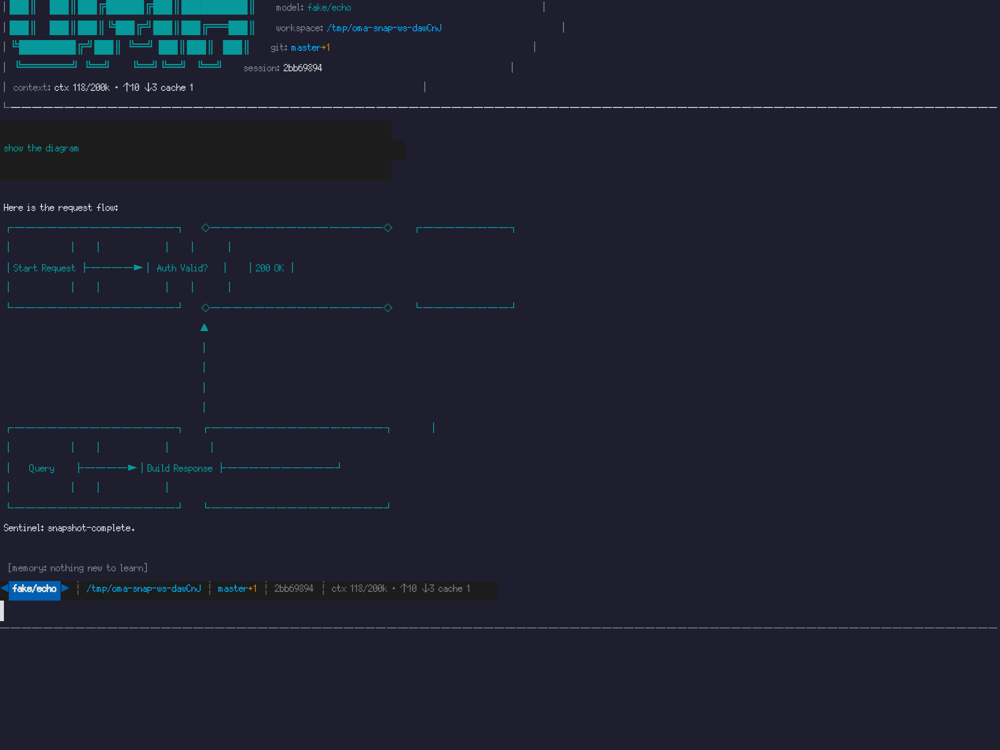

<p align="center">
  <strong>Multi-Agent Team Runtime — 四个 Oma 后端可切换，Agent 工作区即配置文件，Web 和飞书双端实时可见</strong>
</p>


[](https://www.npmjs.com/package/@chengchenccc/oh-my-agent)
[](https://www.npmjs.com/package/@chengchenccc/oh-my-agent)

---

my-agent-team 是一个**团队级 Agent 运行时**。每个 Agent 有独立的工作区（身份、技能、MCP、记忆都是工作区里的文件），运行时可以选择自研 oma 或 claude / pi / omp 四种后端，各自用原生 session 续接上下文。对话在 Web 控制台和飞书群里实时同步，Agent 由 Product Backend 按 Run 调度执行——不掉消息、不重复、所有端看到的状态一致。

## ✨ Highlights

- **四后端可切换** — 自研 oma 与 claude / pi / omp 任一运行,agent 级配置、每 Run 冻结,切后端不丢上下文(各自原生 session 续接,产品只存一个引用)
- **Agent 工作区即配置** — 身份(SOUL/USER)、技能、MCP、产品工具、知识库都是工作区里的文件(AGENTS.md / `.mcp.json` / `.<kind>/skills`),后端自动桥接,人类可直接改文件
- **一个对话一个 Agent** — 对话是 Agent session 的产品态投影;多 Agent 协作 = 多个对话投影到同一件事情(Work)上
- **多 Provider 多协议** — 支持 Anthropic Messages、OpenAI Chat Completions、OpenAI Responses 三种 API 协议;builtin provider 只需环境有 API Key 即自动生效;用户通过 `~/.oma/models.yml` 添加自定义 provider
- **Thinking/Reasoning** — 全链路支持 Anthropic extended thinking、DeepSeek reasoning_content、OpenAI reasoning_effort;Web UI 可选 thinking level
- **终端 TUI（oma）** — 独立交互式终端:流式渲染、工具调用/结果、thinking 与 tool detail 切换、mermaid ASCII 图、`/resume` 与 `/fork`、模型选择持久化到项目 `.oma/settings.json`,composer loader 实时摘要当前动作
- **双端同步** — Web 控制台 + 飞书(Lark IM)Bot,同一条对话两边实时可见
- **对话账本** — canonical conversation store(conversation_ledger),所有消息经单一入口写入,端只做渲染
- **Agent Run 执行链** — 每个 Run 由 Agent Backend spawn 一次性子进程(stdin/stdout JSONL RPC),BackendRunOutcome 是唯一终态,terminal commit 原子写入 History + Context
- **Agentic Workflow** — 声明式节点图（agent/script/human + 条件边 + cron 触发）：agent 节点派发 Agent Run、script 节点进程沙箱执行、human 节点 Web 表单；产物经 Artifact 在节点间流转，Web 可视化编排与调试
- **Product Tools** — History 读写等产品能力由 Product Backend 统一执行(幂等 + 审计)
- **SQLite 单文件存储** — backend.db,零运维部署

## 📸 Screenshots

| Agents | MCP Servers | Knowledge Packs |
|---|---|---|
|  |  |  |

| System (Observability) | Workflow Orchestrator | Chat Run Console |
|---|---|---|
|  |  |  |

| Oma TUI — real session | Oma TUI — tools | Oma TUI — mermaid |
|---|---|---|
|  |  |  |

## 🚀 快速开始

**前置条件：** [Bun](https://bun.sh) >= 1.3

```bash
bun install

# 设置至少一个 provider 的 API Key
export ANTHROPIC_API_KEY=sk-ant-...
# 或 OPENAI_API_KEY / DEEPSEEK_API_KEY / GROQ_API_KEY / OPENROUTER_API_KEY

bun run dev
```

`dev` 会并行启动 backend（HTTP/SSE）和 web（Next.js）。打开：

| 服务 | 地址 |
|---|---|
| Web 控制台 | `http://localhost:3001` |
| Backend API | `http://localhost:3000` |

### 配置模型 Provider

Builtin provider 只需环境变量有对应的 API Key 即自动可用：

| Provider | 环境变量 | 可用模型 |
|---|---|---|
| Anthropic | `ANTHROPIC_API_KEY` | Claude Opus 4.8, Sonnet 5, Haiku 4.5 |
| OpenAI | `OPENAI_API_KEY` | GPT-5.4, GPT-5.2, GPT-5 Mini, o4 Mini |
| DeepSeek | `DEEPSEEK_API_KEY` | DeepSeek V4 Flash, V4 Pro |
| Groq | `GROQ_API_KEY` | Llama 3.3 70B |
| OpenRouter | `OPENROUTER_API_KEY` | Claude Sonnet 5 + 更多 |

自定义 provider 或模型覆盖，在 `~/.oma/models.yml` 中声明：

```yaml
providers:
  my-provider:
    api: openai-completions          # 或 anthropic-messages / openai-responses
    baseUrl: https://my-api.example.com/v1
    apiKeyEnv: MY_API_KEY
    models:
      - id: my-model-v1
        name: My Custom Model
        reasoning: true
        contextWindow: 128000
        maxTokens: 8192
        cost: { input: 1, output: 2, cacheRead: 0.1, cacheWrite: 1 }
        thinking:
          mode: effort                # effort | budget | adaptive
          efforts: [off, low, high]
        compat:
          thinkingFormat: deepseek    # deepseek | qwen | zai | openrouter
          maxTokensField: max_tokens  # 或 max_completion_tokens
```

详细架构见 [`docs/architecture/system-overview.md`](docs/architecture/system-overview.md)（执行链、分层、不变量）。

> **Oma 启动方式**：开发环境 `bun run dev` 开箱即用——Backend 自动用 Bun 运行 `apps/oh-my-agent/src/cli.ts`，无需全局安装或 `bun link`。生产环境通过 `OMA_BIN` 指向构建后的 `apps/oh-my-agent/dist/cli.js` 绝对路径（详见 `apps/backend/.env.example`）。
> **npm 包**：`@chengchenccc/oh-my-agent` —— [https://www.npmjs.com/package/@chengchenccc/oh-my-agent](https://www.npmjs.com/package/@chengchenccc/oh-my-agent)

## 📦 仓库结构

```
apps/
  backend/       Product Backend — HTTP/SSE、账本、Agent Context、Agent Run、Workflow、Artifact、Product Tools MCP、workspace bridge
  oh-my-agent/   Oma CLI — print/json/rpc/TUI 模式，被 backend 按 Run spawn
  web/           Web 控制台 — Next.js 15 + shadcn/ui + React Query
  lark-bot/      飞书 Bot 适配器

packages/
  message/             协议层：Message 类型、ChatModel、Tool、stream-utils（无 run loop）
  agent-contract/      Agent Backend 中立契约：BackendRunInput/Outcome/Event/Segment
  adapter-oma-agent/   Adapter — spawn 自研 child、JSONL 读写、steer/abort/approval、并发上限
  adapter-claude-agent/ Adapter — spawn claude CLI（stream-json、--resume/--mcp-config）
  adapter-pi-agent/    Adapter — spawn pi CLI（--session/--provider/--model）
  adapter-omp-agent/   Adapter — spawn omp CLI（-r/--thinking）
  adapter-mcp/         MCP client adapter — 外部 MCP server 接入
  workflow/            Agentic Workflow DSL 纯域层（节点图、JSON-Logic、computeNext 引擎）
  sandbox/             进程沙箱 — workflow script 节点 / oma eval 工具的隔离执行
  ai/                  多 API Provider：ApiImplementation 注册表 +
                       createProvider 工厂 + fetchSSE 共享传输 + per-API compat 系统 +
                       BUILTIN_CATALOG + parseCatalogYAML 运行时模型配置
  source-fetch/        git/zip 源物化基座（oma marketplace 与 backend skill-pack 共用）
  tui/                 终端 UI 工具箱（oma TUI 的 editor/markdown/mermaid 支撑）
  api-contract/        跨进程类型契约（SSE 事件、Eden Treaty）
  config/              配置加载
  test-helpers/        测试工具（echoModel）
```

## 📖 文档

| 文档 | 说明 |
|---|---|
| [架构文档](docs/architecture/README.md) | 系统总览、执行链、各模块设计、决策记录——按「你想干什么」组织阅读路线 |

## 🛠 开发
```bash
bun run format      # Biome 格式化
bun run lint        # Biome + ESLint
bun run typecheck   # tsc --noEmit（全仓）
bun run test        # 全仓测试
bun run build       # 全仓构建（turbo）
```

> **数据库升级策略**：迁移只保证 fresh-boot 路径。改动 schema 后若旧开发库
> 启动异常，直接删掉 `apps/backend/.backend-data/` 重启即可（开发数据,非持久
> 事实）——不存在 in-place 升级路径,旧库兼容问题不修。

## 📄 License

MIT
