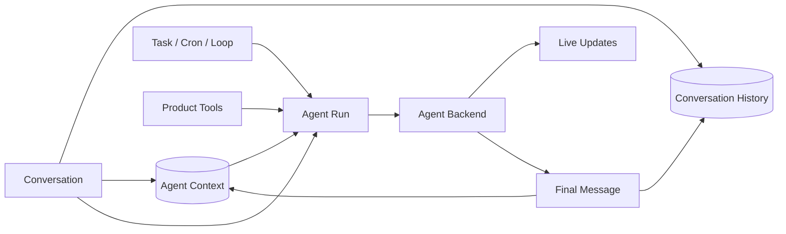

# Product Backend 总览

Product Backend 是系统的产品核心。它拥有 Conversation、成员、共享消息、Agent 上下文分支、Task、Cron、Loop 和面向端的 HTTP/SSE API。它不再把自研 Agent loop 当作唯一执行方式；Claude Code、Codex、OpenCode 和 Coding Agent 都通过 Agent Backend 接入。

## Product Backend 拥有什么

| 领域 | Product Backend 的职责 |
|---|---|
| Agent | 身份、角色、默认 Agent Backend/Model、workspace、权限与产品配置 |
| Conversation | 成员、触发规则、Conversation History、可见性与 hop control |
| Agent Context | 每个 Agent Member 实际消费/产生的语义上下文、branch 与 summary |
| Agent Run | branch 级单 active run、终态提交、steer/follow-up 队列 |
| Task / Cron / Loop | 决定何时为哪个 Agent 创建 Run |
| Product Tools | Conversation、Task、Memory、Artifact、审批、History |
| Live Updates | Agent Run 的实时文本、thinking、tool 和状态更新 |

Product Backend 不拥有 Agent Backend 内部 transcript、原生 tools、context cache、compaction、retry 或 sub-agent。

## 核心关系



### Conversation History

所有成员共享的会话事实。它保存人类与 Agent 的最终可见 Message、成员事件和产品控制条目。端从 History 重放，不依赖某个 Agent Backend 的私有 session。

### Agent Context

一个 `(conversationId, agentMemberId)` 对应一份 Agent Context。内部用 parent-linked entries 支持 branch/fork/rollback；公开语义是这个 Agent 实际消费和保留了什么。

### Agent Runs

Agent Run 是执行控制面的领域对象：固定 Context Branch、Agent Backend、model/config snapshot 和唯一终态。Product Backend 保证同一 Context Branch 最多一个 active Run，并持久化 normal、steer、follow-up 输入。

Execution session 的查找、resume、close 和 crash recovery 是 Agent Run 模块内部的 cache 管理，不是独立产品概念。

### Agent Backend

Agent Run 通过 `backendKind` 选择一个 Agent Backend：

```text
claude-code
codex
opencode
coding-agent
```

每个 Backend 声明自己真实支持的 session、resume、steer、thinking 和 Product Tool 接入能力。

### Product Tools

Product Tools 由 Product Backend 统一执行并拥有权限、身份、幂等和审计。MCP 是 Coding Agent 等执行引擎的接入方式，不是 Product Tool 的领域身份。

## Message 如何进入 History 和 Context

### 人类消息

人类消息先写 Conversation History。只有 Agent 实际被触发时，Backend 才按 `ledgerCursor + visibility + context budget` 将该 Agent 真正消费的 Message refs 追加到 Agent Context。

获取 branch run ownership、同步 Ledger refs、推进 `ledgerCursor` 和创建 Agent Run 必须在同一事务中完成。若 branch 已有 active run，输入写入持久 `branch_input_queue`，不能先修改 Tree 再等待锁。

### Agent 输出

Live Updates 只用于实时展示。Agent Backend 返回 terminal outcome 后，Product Backend 在一个数据库事务中：

```text
写最终 assistant Message 到 Conversation History
→ 追加 Agent Context Message ref
→ 更新 Context Branch
→ 更新内部 execution session 同步点
```

如果事务失败，不能把 Agent Run 标记为完成。

## Context Branch 与 execution session

每个 Context Branch 固定一个 Agent Backend。Fork 默认继承，也允许显式选择新的 Backend；新 branch 从分叉点的 Agent Context 建立 execution session。

Execution session ID、同步 entry、revision 和 active/stale/detached 状态只是内部 cache metadata。Rollback、move leaf、fork、summary 变化和历史可见性修正都会使其 stale。

## Agent Run 并发

Product Backend 不允许同一 branch 并行 Agent Run。新输入根据语义进入：

- normal：branch 空闲时开始；
- steer：希望尽快影响当前工作；
- follow-up：等待当前 Agent Run 结束后处理。

Agent Backend 支持 native steer 时可立即转发，否则 steer 在安全 run boundary 作为下一输入。内部 sub-agent 属于同一 Agent Run。

三类输入都先进入持久队列；Backend 明确接收后才标记 delivered。Product Backend crash 后按 branch 内原顺序恢复。

## Execution session 恢复（内部实现）

Agent Run execution 优先使用 Backend 原生 resume，但必须验证：

```text
backend kind
branch ID
synced-through entry
product revision
```

任一不匹配都从 Agent Context 当前 branch 重建线性 `ProjectedHistoryItem[]`，创建新的 execution session。Execution session 不能反向覆盖 Agent Context。

## 按需读取更早 History

触发时默认只同步最近 N 条或 token 预算内的可见 History entries。更早历史通过 Product History Tool 渐进读取。

读取历史不会自动永久进入 Context；只有显式 retain 才追加 Message ref。

## Product Summary

Product Policy 根据 Context 预算触发 Summary。Summary 只改变发送给 Backend 的输入，不删除原始历史。

Agent Backend 内部仍可做 compaction，但那只是可丢弃优化。

## Live Updates

Product Backend 定义稳定 Live Updates。Agent Backend 只映射实际支持的信息，独有事件使用 `backend.<kind>.*`；产品业务状态机只依赖核心更新和 `BackendRunOutcome`。

## 失败原则

| 失败 | Product Backend 行为 |
|---|---|
| Backend process crash | session state 标 stale，尝试原生 resume；失败则从 Agent Context 重建 |
| Backend event parsing failure | Agent Run failed，保留 raw diagnostic，不提交 final Message |
| Live Updates 推送失败 | 不影响事实；客户端从 Conversation History 恢复 |
| History + Context transaction 失败 | Agent Run 进入 commit_failed；幂等重试，成功前不释放 branch，最终失败则丢弃 execution session |
| Product Tool 失败 | 返回标准化 tool result；按语义决定是否写 Agent Context |
| Backend capability 缺失 | 明确 fallback 或 unsupported，不模拟虚假能力 |

## 不变量

1. Product Backend 是产品事实 owner。
2. Agent Backend 不拥有 Conversation History 或 Agent Context。
3. Conversation History 与 Agent Context 分别保存共享事实和单 Agent 语义历史。
4. Execution session 是可丢弃 cache。
5. 同一 Context Branch 最多一个 active Agent Run。
6. Terminal outcome 决定 Agent Run 终态。
7. History Message 与 Context ref 必须原子提交。
8. Backend 私有能力不能污染核心产品协议。

## 关联页面

- [系统总览](../system-overview.md)
- [Agent Context](../agents/context.md)
- [Agent Backend](../execution/agent-backend.md)
- [Conversation History](../conversation/history.md)
- [事实与投影](../foundations/facts-and-projections.md)
- [数据模型](./data-model.md)
