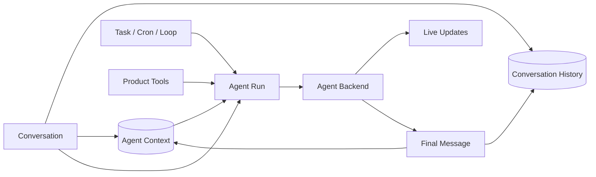

# Product Backend 总览

Product Backend 是系统的产品核心。它拥有 Conversation、成员、共享消息、Agent Context 分支、Cron、Loop 和面向端的 HTTP/SSE API。执行只有一条链：**Agent Run → Agent Backend → 一次性 coding-agent 子进程**。

## Product Backend 拥有什么

| 领域 | Product Backend 的职责 |
|---|---|
| Agent | 身份、角色、默认 Model、workspace、权限与产品配置 |
| Conversation | 成员、触发规则、Conversation History、可见性与 hop control |
| Agent Context | 每个 Agent Member 实际消费/产生的语义上下文、branch 与 summary |
| Agent Run | branch 级单 active run、终态提交、normal/steer/follow-up 队列 |
| Cron / Loop | 决定何时为哪个 Agent 创建 Run |
| Product Tools | History 读写、审批等产品能力；权限、幂等、审计 |
| Live Updates | Run 的实时文本、thinking、tool 和状态更新（可丢） |

Product Backend 不拥有子进程内部的模型循环、原生 tools、compaction、retry 或 todo —— 那些属于 Coding Agent。

## 核心关系



### Conversation History

所有成员共享的会话事实。它保存人类与 Agent 的最终可见 Message、成员事件和产品控制条目。端从 History 重放，不依赖子进程的私有 transcript。

### Agent Context

一个 `(conversationId, agentMemberId)` 对应一份 Agent Context。内部用 parent-linked entries 支持 branch/fork/rollback；公开语义是这个 Agent 实际消费和保留了什么。

### Agent Runs

Agent Run 是执行控制面的领域对象：固定 Context Branch、model/config snapshot（systemPrompt/skillRoots 冻结）、唯一终态。Product Backend 保证同一 Context Branch 最多一个 active Run，并持久化 normal、steer、follow-up 输入到 `branch_input_queue`。

### Agent Backend

Agent Run 通过 `backendKind = "coding_agent"` 选择执行引擎。Adapter spawn 一次性 child 进程执行；`runId` 是唯一执行身份。无 daemon、无 session、无 resume。

### Product Tools

Product Tools 由 Product Backend 统一执行并拥有权限、身份、幂等和审计（`product_tool_call` 表）。Product Tools MCP 是 child 的接入方式，不是 Product Tool 的领域身份。

## Message 如何进入 History 和 Context

### 人类消息

人类消息先写 Conversation History。只有 Agent 实际被触发时，Backend 才按 `ledgerCursor + visibility + context budget` 将该 Agent 真正消费的 Message refs 追加到 Agent Context。

获取 branch run ownership、同步 Ledger refs、推进 `ledgerCursor` 和创建 Agent Run 必须在同一事务中完成。若 branch 已有 active run，输入写入持久 `branch_input_queue`，不能先修改 Tree 再等待锁。

### Agent 输出

Live Updates 只用于实时展示。子进程返回 terminal `BackendRunOutcome` 后，Product Backend 在一个数据库事务中：

```text
写最终 assistant Message 到 Conversation History（agent_run_id 唯一提交标记）
→ 追加 Agent Context Message ref
→ 更新 Context Branch
→ 标记 Agent Run terminal
```

如果事务失败，Agent Run 进入 commit_failed，不能把 Run 标记为完成。

## Agent Run 并发与输入队列

Product Backend 不允许同一 branch 并行 Agent Run。新输入根据语义进入：

- normal：branch 空闲时开始；
- steer：希望尽快影响当前 Run（Adapter 立即转发给 live child）；
- follow-up：当前 Agent Run 结束后处理。

三类输入都先进入持久队列；Adapter 明确接受后才标记 delivered。Product Backend crash 后按 branch 内原顺序恢复（`listIdleBranchesWithPendingInputs` 在启动时恢复）。

## 失败原则

| 失败 | Product Backend 行为 |
|---|---|
| child 启动失败 / crash / malformed output | 该 Agent Run failed，保留 raw 诊断，不提交 final Message |
| preflight / projection / spawn / acceptance 失败 | 该 Agent Run failed，input cancelled，branch 释放（不重投、不产生 zombie） |
| terminal commit 事务失败 | Run 进入 commit_failed；幂等重试，成功前不释放 branch |
| Live Updates 推送失败 | 不影响事实；客户端从 Conversation History 恢复 |
| Product Tool 失败 | 返回标准化 tool result；按语义决定是否写 Agent Context |

## 不变量

1. Product Backend 是产品事实 owner。
2. Agent Backend 不拥有 Conversation History 或 Agent Context。
3. Agent Run 是唯一 Product execution identity（无 span/attempt/session）。
4. 同一 Context Branch 最多一个 active Agent Run。
5. Terminal outcome 决定 Agent Run 终态。
6. History Message 与 Context ref 必须原子提交。
7. 每个 Run 是 full Product Context projection，无跨 Run session/resume。
8. child 私有能力不能污染核心产品协议。

## 关联页面

- [系统总览](../system-overview.md)
- [Agent Context](../agents/context.md)
- [Agent Backend](../execution/agent-backend.md)
- [Conversation History](../conversation/history.md)
- [事实与投影](../foundations/facts-and-projections.md)
- [数据模型](./data-model.md)
