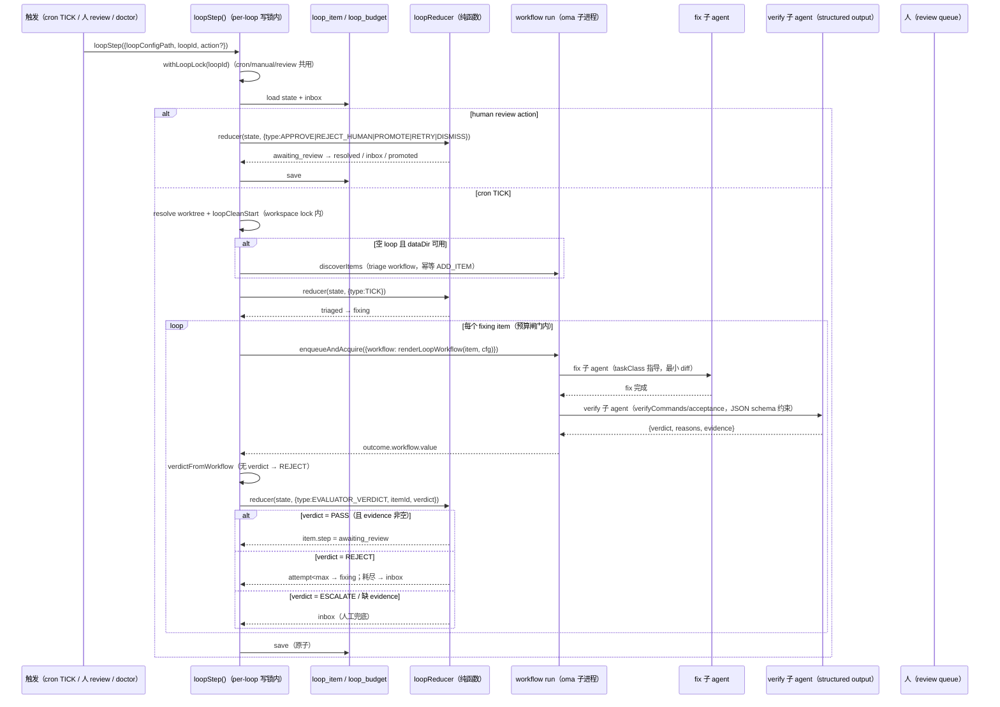

# Loop 验证端到端

这页画一次触发里 [loopStep()](../backend/loop-runner.md) 在 per-loop 写锁内 load [DB 状态](../foundations/loop.md)、对 `fixing` item 渲染 **workflow 脚本**（fix + verify 两个子 agent）交给 oma 子进程执行、从 `outcome.workflow.value` 硬化解析 verdict 经 `loopReducer` 转移 `item.step` 的完整时序。先读 [Loop](../foundations/loop.md) 拿状态机与 LOOP.md 契约，再读 [LoopRunner](../backend/loop-runner.md) 拿 loopStep 签名，本页只讲它们在一次 `loopStep()` 调用里怎么串起来。

> 执行模型为 workflow-first（[ADR 0025](../../adr/0025-loop-workflow-first-execution.md)）：Generator/Evaluator 双 Agent 角色已删除。

## 时序图

## 一步的流程

1. **拿锁 + 读状态**：`loopStep()` 先拿 per-loop 写锁（三入口共用，见 [loop-lock.ts](../../../apps/backend/src/features/loop/loop-lock.ts)），从 DB load state + inbox。
2. **cron TICK → workflow run**：空 loop 先 auto-triage；`loopReducer(TICK)` 把 `triaged` 推到 `fixing`；对每个 `fixing` item，过预算闸门（`loop_budget` 计数），渲染 workflow 脚本并 `enqueueAndAcquire`。脚本内 fix 子 agent 干活，随后 verify 子 agent 对照 `acceptance`/`verifyCommands` 动手验证。
3. **verdict 硬化解析**：workflow 返回 `{ verdict, reasons, evidence }`。`verdictFromWorkflow()` 只认 `PASS`/`REJECT`/`ESCALATE`；**无可用 verdict = 验收未执行 = REJECT**（变化即回滚）；`verifyCommands` 存在时每条命令必须有完整输出，无输出 = 未验证。
4. **verdict 转移 step**：loopStep **不看 run 终态**，读 verdict 喂 `loopReducer(EVALUATOR_VERDICT)`：
   - `PASS` + evidence 非空 → `awaiting_review`，等人拍板。
   - `PASS` 但 evidence 空 → **inbox**（reducer 的 PASS-without-evidence gate，防点头回路）。
   - `REJECT` 且 `attempt < maxRetries` → 回 `fixing`（reason 作返工反馈）；耗尽 → `inbox`。
   - `ESCALATE` → `inbox`。
5. **写回 DB**：save（原子）；中间进程重启不影响——状态在 DB。
6. **人 review（独立调用）**：几小时后人在 review queue 拍板，`loopStep({action})` 独立调用一次，`loopReducer` 把 `awaiting_review` 转成 `resolved`/`inbox`/`promoted`。中间进程重启不影响。

## 为什么读 verdict 而不是读 run 终态

这是整条流的关键判断。run succeeded 只意味着**执行进程跑完了**，不意味着**产出满足了 acceptance**——验证者完全可以跑完并判定「没达标」。

所以 step 的推进从「run 终态」换成「verdict 内容」：run 是执行事实，verdict 是对照 `acceptance` 的业务裁决。这守住[设计哲学](../design-philosophy.md)「terminal state 在业务本体上表达，不靠旁路事件推断」。workflow-first 把这条内建进执行模型：verdict 是 workflow 脚本的**返回值**（structured output 约束），不再靠外层模型用 write tool 改 meta 文件（ADR 0025 修掉的脆弱写回链）。

### 为什么 verify 是脚本内子 agent，而不是独立外层 Evaluator

- **maker-checker 保留**：verify 子 agent 与 fix 子 agent 是同一 workflow 脚本内的两条独立子 agent 线，验证者不看生成者的思维链，只对照产出与 `acceptance`——比外层 Evaluator 更简单：不需要第二条 Agent Run、不需要 meta 写回链、verdict 是函数返回值。
- **structured verifyCommands**：验收命令进 LOOP.md（`workflow.verifyCommands`），verify 子 agent 被强制逐条执行并贴完整输出——「验证了什么」可审计。

## 返工回路怎么闭合

`REJECT` 把 item 送回 `fixing`，verdict 的 `reason` 作为返工反馈注入下一轮 fix prompt。整条 REJECT 路径与人工驳回（`REJECT_HUMAN`）复用同一套 loopReducer 转移。attempt 耗尽则进 `inbox` 挂起，等人处理——不静默死循环。

## 失败模式（带严重度）

S1 = 静默烧钱 / 静默错交 / 数据丢失，S2 = 回路卡死或退化，S3 = 局部瑕疵。

| 严重度 | 失败模式 | 触发场景 | 缓解 |
|---|---|---|---|
| **S1** | **Verifier Theater（假验证）** | verify 子 agent 光读不动手，或产出空 `evidence` 就判 PASS | `verifyCommands` 强制逐条执行 + 完整输出贴 evidence；PASS-without-evidence → inbox；无 verdict → REJECT |
| **S1** | **预算 cap 被冲穿（无声烧钱）** | 多入口并发各放行一轮 | `loop_budget` 表原子计数 + per-loop 写锁；workflow run 冻结 `workflowBudgetTokens`，子进程内子 agent spawn 受闸门约束；超限熔断 + Ledger 通知 |
| **S1** | **非代码类无靶子** | changelog / 依赖升级这类 item，acceptance 写不出「可跑的测试」，verify 退化回点头 | acceptance 必填**可观测的完成定义**；写不出可验收标准的 item 类型只先跑到报告、不自动 resolve |
| **S1** | **Escalation Failure（升级失灵）** | budget_exceeded 或 verdict 缺失后回路默默停住，没人知道 | 熔断留门：暂停调度 + Ledger run-log + 给人开 review / 发通知，绝不静默死掉 |
| **S2** | **Zombie Run（坏死 run 占 branch）** | active run 已死但 branch 未释放，后续 tick 撞上 | Loop Doctor `abortStaleRun` 释放 branch；cron 超时 abort 立即释放；`withTimeout`/`runTimeoutMs` 兜底 |
| **S2** | **Stale Item（状态腐烂）** | run 已 terminal 但 item 卡 fixing/verifying | Doctor 巡检 ESCALATE → inbox；投影层（看板/review queue）按 step 过滤 |
| **S2** | **verdict 缺失** | workflow run 成功但没吐出可解析 verdict | 视为「未裁决」：REJECT（有变化回滚）或 ESCALATE，不盲目 PASS |
| **S3** | **同 item 重入撞键** | 返工重入同一 item | idempotency key 带 `:<baseSha>` 序号；replay 短路对 terminal 非 completed 发 fresh run |

## 关联页面

- [Loop](../foundations/loop.md) — item step 状态机、LOOP.md 契约、DB 持久化
- [LoopRunner](../backend/loop-runner.md) — `loopStep()` 与 loopReducer
- [定时任务](../foundations/cron-job.md) — 调度者与单飞锁的边界
- [ADR 0025](../../adr/0025-loop-workflow-first-execution.md) — workflow-first 决策
- [架构设计哲学](../design-philosophy.md)
