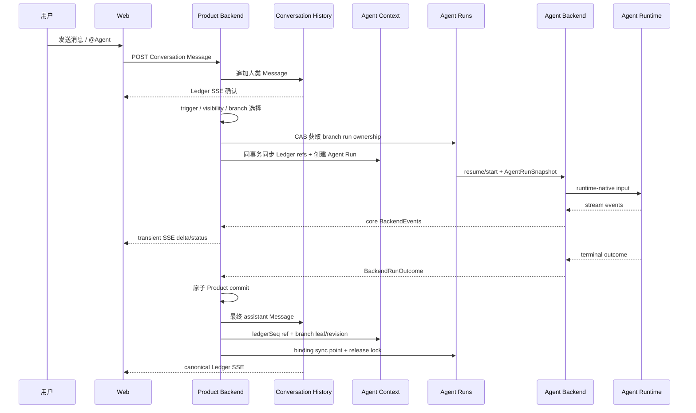

# Web 消息端到端

本页用一条 Web 消息串起 Product Backend、Agent Context 和 Agent Backend 的边界。

## 时序



## 1. 人类 Message

Web 可以先显示乐观消息，但 Product Backend 写入 Conversation History 后才形成共享事实。Ledger SSE 使用稳定 message identity 与乐观消息对账。

## 2. Agent 触发与 Tree 同步

Backend 根据 trigger mode、mention、addressedTo、权限和 branch 选择目标 Agent。

消息不会发送时就复制到所有 Agent Tree。目标 Agent 真正启动 Agent Run 时，Backend 根据 `ledgerCursor` 查询尚未消费的可见 Ledger entries，并按照统一 N 条或 token budget 选择最近历史，追加 refs 到当前 branch。

更早上下文通过 Product History MCP 渐进加载；只有显式 retain 才永久追加到 Tree。

## 3. Agent Runs

Pool 使用 branch scope key 查找 live execution session。若 binding 的 backend、branch、同步 entry 和 product revision 完全匹配，则优先调用 Adapter 原生 resume/send；否则从 Agent Context 当前 branch 投影线性 `ProjectedHistoryItem[]`，启动新 execution session。

同一 branch 同时最多一个 active run。其他输入进入 normal、steer 或 follow-up 队列。

获取 branch run ownership、同步 Ledger refs、推进 cursor 和创建 Agent Run 是同一事务。无法获得 ownership 的输入进入持久 normal/steer/follow-up queue，不能并发修改 Tree。

## 4. Streaming

Adapter 把 Runtime 原生 stream 映射为 Product Backend 核心事件。Web 可以实时显示 text、thinking、tool 和 status，但这些更新是 transient projection，不写 canonical Tree。

Backend-specific 事件可以显示在诊断 UI，但产品逻辑不依赖它。

## 5. Terminal commit

只有 terminal `BackendRunOutcome` 决定 Agent Run 终态。Completed 时，Backend 在同一事务完成：

```text
Ledger final Message
Tree ledger_message ref
branch leaf/revision
execution session binding sync point
Agent Run completed
```

事务成功后 Web 从 Ledger SSE 收到 canonical Message，branch lock 才释放。

## 6. Steer 与 follow-up

- normal、steer、follow-up 都先进入持久产品队列；
- steer 在 Adapter 支持 native steer 时立即转发，否则在安全 run boundary 发送；
- follow-up 始终等待当前 Agent Run terminal 后发送；
- Runtime 内部 sub-agent 不创建额外 Agent Run。

## 7. 失败与恢复

| 场景 | 恢复方式 |
|---|---|
| Web 断线 | 从 Ledger 重放已提交历史，从 Agent Run 状态恢复执行 UI |
| Runtime process crash | 原生 resume；同步点不匹配或 resume 失败则从 Agent Context 重建 |
| Streaming delta 丢失 | 不影响 canonical history |
| Product commit 失败 | Agent Run 进入 commit_failed，保存 terminal outcome，binding 标 stale；幂等重试 commit，成功前不释放 branch，失败到底则 detach execution session |
| Branch rollback | execution session binding stale，下次从新 branch 投影重建 |

## 不变量

1. Web 不是事实来源。
2. Ledger 保存共享历史，Tree 保存该 Agent context。
3. Streaming 不是 canonical history。
4. Terminal outcome 是完成依据。
5. Ledger 与 Tree terminal commit 原子。
6. Branch 内 Agent Backend 固定。
7. Execution session 可丢失，Agent Context 不可丢失。

## 关联页面

- [系统总览](../system-overview.md)
- [Conversation History](../conversation/history.md)
- [Agent Run 输出与实时更新](../runs/output-and-live-updates.md)
- [Agent Context](../agents/context.md)
- [Agent Backend](../execution/agent-backend.md)
