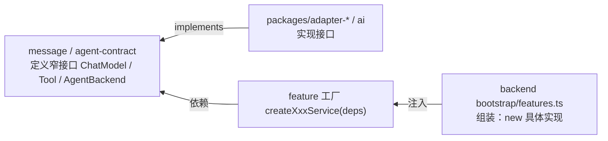

# 依赖注入

一个函数想用某个能力，应该「自己造」还是「让别人给」？本仓的统一答案是**让别人给**：具体实现由顶层组装，逐层注入；中间每一层只认抽象接口。

## 主轴：依赖箭头指向内层

- `packages/message/src/chat-model.ts` 定义 `ChatModel.stream()` 纯抽象，不知道任何 provider 存在
- `packages/ai` 实现 provider（`createProvider` 注册表 + `createModelRuntime`）
- `apps/backend/src/bootstrap/features.ts` 是组合根：所有 `new` 集中于此，向下注入 service 工厂
- `packages/agent-contract` 定义 `AgentBackend`（execute/steer/abort/resolve_approval）；四个 adapter 实现，backend 只按 `backendKind` 选 entry，不认具体子进程

## 当前代码中的注入手法

### 1. Port-Adapter（窄接口 + 外层实现）

每个 backend feature 的六边形结构：`domain.ts`（纯类型）/ `ports.ts`（存储边界接口）/ `service.ts`（`createXxxService(deps)` 工厂）/ `adapter-sqlite.ts`（Drizzle 实现）/ `http.ts`（Elysia 路由）。

### 2. 函数式策略注入

- `resolveWorkspace` / `resolveRunConfig` / `resolveAgentEnabled` 作为函数注入 `AgentRunExecutionService`（工作区、Run 配置、开关策略可替换）
- `trigger-scheduler` 注入 `schedule(expr, fn) => { stop() }` 与 `startExecution`——调度器不绑死 Bun.cron，测试可注入假调度器
- `node-runners` 注入 `onLog` 回调：script 节点结构化日志进事件流，执行层不感知事件总线

### 3. 工厂注入 + 合理缺省

`createOmaSession({ model, workspaceRoot, plugins, tools, store, ... })` 构造期聚合协作者；retry/compaction/maxSteps 给默认值再覆盖——**注入但有合理缺省**。

### 4. 注册表分派

- `backends: BackendRegistry`（oma/omp/pi/claude_code 各自 `{ backend, catalog }`），dispatch 按 `modelRef.backendKind` 查表
- `packages/ai` 的 provider 注册表 + api 实现注册表（OCP：加 provider 不改既有代码）

### 5. 组合根（Composition Root）

所有 `new 具体实现` 集中在 `apps/backend/src/bootstrap/features.ts`；其余模块只接收、不创建。业务函数体里出现 `new AnthropicChatModel` / `new Bun.cron` / 具名落盘实现，都是 DI 漏洞。

## 判断准则

1. 注入「能力」，不是「造能力的原料」——要 `AgentBackend`，不收 `kind + spawn 细节` 自己现拼
2. 注入抽象；被注入方不知道实现是谁（依赖 `ChatModel` 不依赖 `AnthropicChatModel`）
3. 接口要窄——声明的依赖 = 实际用到的依赖
4. 区分 composition root 与 business logic——`new` 只进组装根
5. 构造期注入优先于调用期透传——稳定边界一次绑定，调用期只传每次都变的输入

## 红旗信号

- 业务函数体里 `new` 具体模型/存储/调度器
- 一个函数同时收「id」和「能查这个 id 的 service」，再在体内现造对象
- 想写单测却发现必须连带 mock 真实模型 API + 真实落盘

## 关联页面

- [架构设计哲学](../design-philosophy.md)
- [Product Backend 总览](../backend/overview.md)
- [Oma Runtime](../runtime/oma.md)
