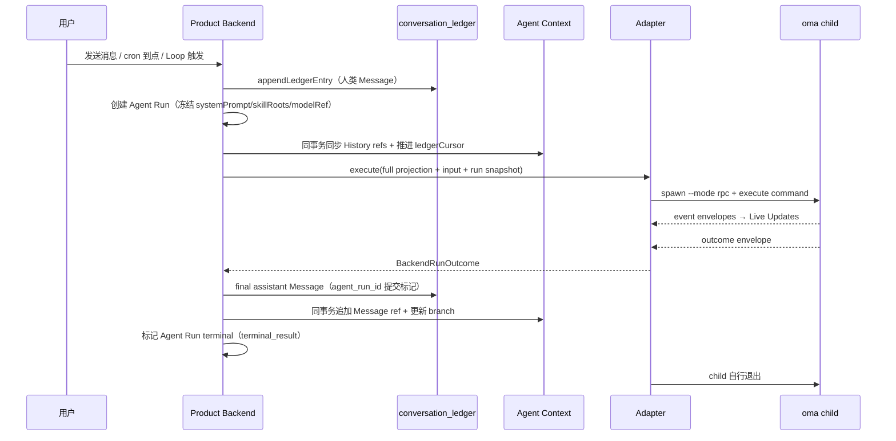

# 生命周期总览

## 一次 Agent Run 的主流程

## 分阶段说明

**1. 发起**　Product Backend 收到触发信号（人发消息 / cron 到点 / Loop Generator/Evaluator），写入输入与 Run 快照。

**2. 排队与 acquire**　输入进入 `branch_input_queue`。同一 branch 最多一个 active Run：空闲则立即 acquire，忙则排队（steer 可注入 live Run，follow_up 等 terminal）。

**3. 执行**　Adapter 为 Run spawn 一次性 `oma --mode rpc` 子进程，stdin 发 `execute` command，stdout 收 event/outcome envelopes。子进程内 per-Run Runtime 跑模型/工具循环（retry、compaction、todo、skill 加载）。

**4. 固化事实**　terminal `BackendRunOutcome` 到达后，Product Backend 在同一事务写 final assistant Message（`agent_run_id`）到 Ledger、追加 Context ref、更新 branch、标记 Run terminal。事务失败 → commit_failed，幂等重试。

**5. 收尾**　child 在 outcome 后自行退出（one Run → one outcome → exit）；Adapter 回收 spawn slot。follow_up 输入在 terminal commit 后开始下一个 Run。

## 关键状态

| 阶段 | 状态 | 说明 |
|---|---|---|
| 输入已入队 | queue `pending` | 等待 acquire |
| Run 已创建 | `running` / `waiting` | waiting = 等待审批/问答（Product Tools MCP 同步等待） |
| 执行完成 | outcome 到达 | 还未提交产品事实 |
| 提交中 | `commit_failed` | terminal 事务失败，幂等重试 |
| 终态 | `completed` / `failed` / `aborted` / `timeout` | 唯一终态；completed 才有 final Message |

## 关联页面

- [事实与投影](facts-and-projections.md)
- [Agent Run 输出与实时更新](../runs/output-and-live-updates.md)
- [Agent Backend](../execution/agent-backend.md)
- [Web 消息端到端](../flows/e2e-web-message.md)
