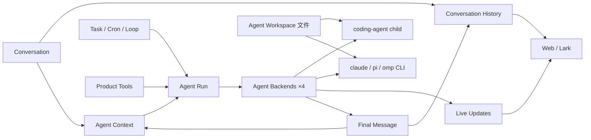
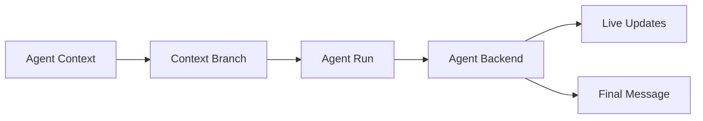
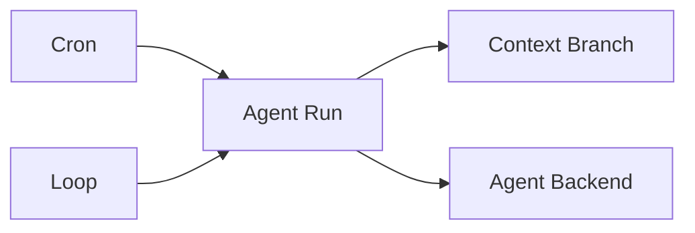

# 跨页架构地图

本图展示当前 Product Backend 架构的核心页面关系。

## 核心关系



## 消息路径

```text
Web/Lark input
→ Conversation History
→ trigger + visibility
→ Agent Context refs
→ Agent Run
→ Agent Backend spawn child
→ Live Updates
→ terminal outcome
→ atomic History + Context commit
```

详见：

- `flows/e2e-web-message`
- `runs/output-and-live-updates`
- `conversation/history`
- `agents/context`

## Context Branch 与 Agent Run



子进程内部的 loop、compaction、todo、ModelRuntime 都是具体执行引擎的实现，不进入公共架构地图。

## 自动化



Cron、Loop 选择 Agent 与 Context Branch，但不依赖子进程内部实现。
