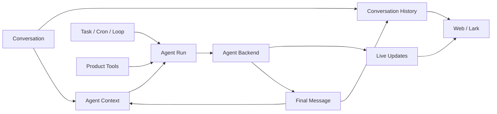
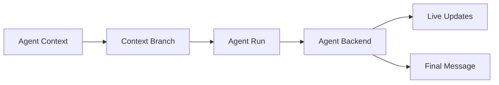
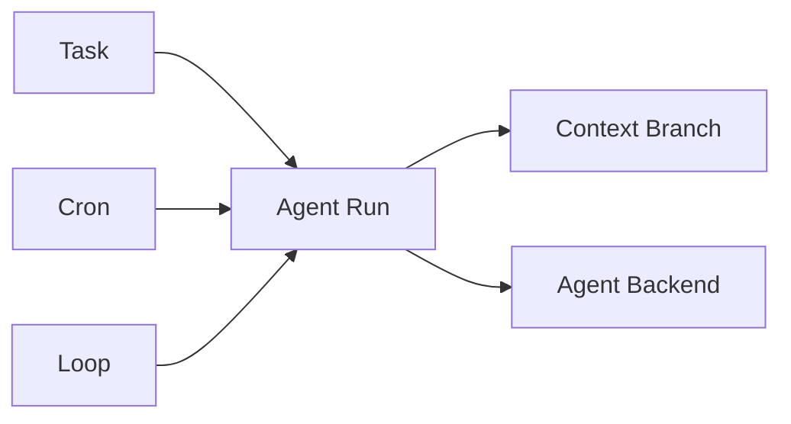

# 跨页架构地图

本图展示目标 Product Backend 架构的核心页面关系。

## 核心关系



## 消息路径

```text
Web/Lark input
→ Conversation History
→ trigger + visibility
→ Agent Context refs
→ Agent Run
→ Agent Backend
→ Live Updates
→ terminal outcome
→ atomic History + Context commit
```

详见：

- `flows/e2e-web-message`
- `runs/output-and-live-updates`
- `conversation/history`
- `agents/context`

## Context Branch 与 Agent Backend



Execution session、projection、transport、MCP、Worker 和 ModelRuntime 都是具体 Backend 的内部实现，不进入公共架构地图。

## 自动化



Task、Cron、Loop 选择 Agent 与 Context Branch，但不依赖某个具体执行引擎。
