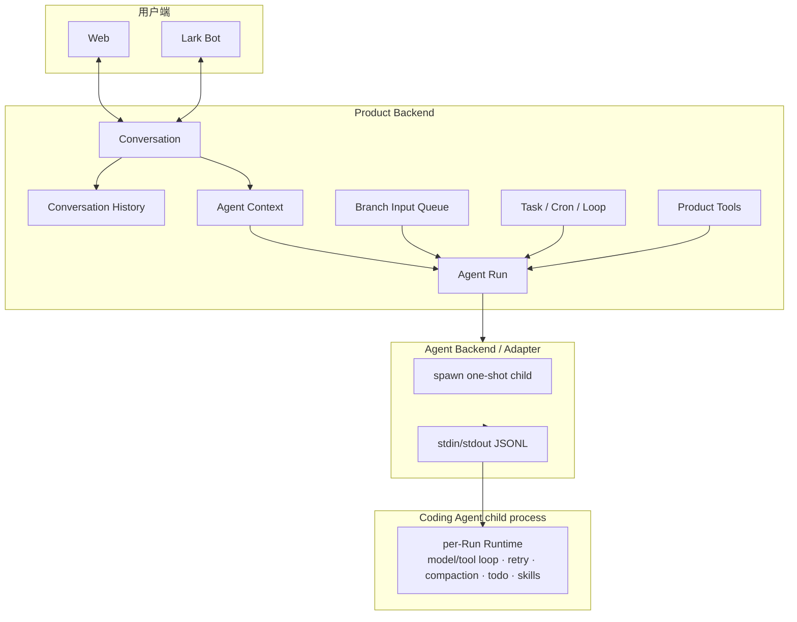
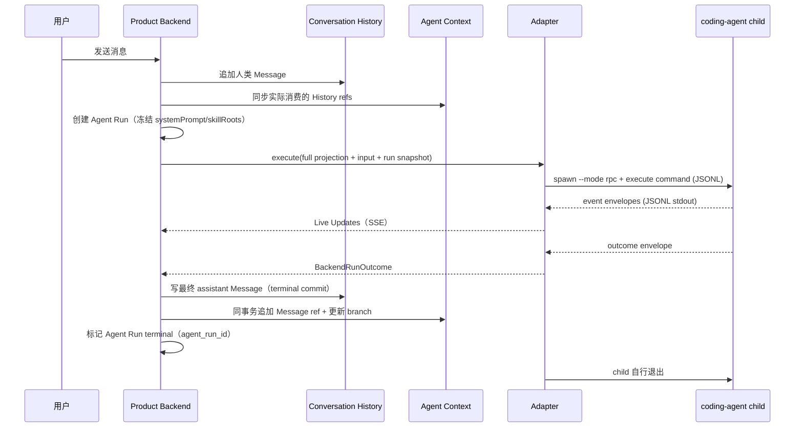

# 系统总览

本页描述**当前架构**：Product Backend 拥有用户和产品能够依赖的全部事实；Agent Backend 负责执行 Agent Run，且当前只有一个执行引擎 —— Coding Agent 子进程。

## 一句话模型

```text
Product Backend 保存 History 和 Context，创建并提交 Agent Run。
Agent Backend 为每个 Run spawn 一次性 coding-agent 子进程。
子进程内的 per-Run Runtime 跑模型/工具循环，产出 BackendRunOutcome。
Product Backend 在 terminal outcome 后原子提交最终 Message 与 Context。
```

## 唯一执行链

```text
Product Backend
→ durable Agent Run
→ full Product Context projection
→ Agent Backend (packages/adapter-coding-agent)
→ spawn one-shot coding-agent child (--mode rpc, stdin/stdout JSONL)
→ per-Run Coding Agent Runtime (packages/agent)
→ BackendRunOutcome
→ atomic Product terminal commit
```

一次 Agent Run = 一个子进程 = 一个 Runtime = 一个 outcome。`runId` 是唯一执行身份；不存在跨 Run 的 session、resume 或 daemon。

## 容器视图



## 核心所有权

### Product Backend 拥有

- Conversation History（conversation_ledger）；
- Agent Context / Context Branch（agent_context_tree / entry / branch）；
- Agent Run（agent_run，唯一执行身份）与 branch input queue；
- Product Tools（权限、身份、幂等、审计，product_tool_call）；
- Agent 身份与配置、Run 的 systemPrompt/skillRoots 快照；
- final assistant Message 与 terminal commit（agent_run_id 唯一提交标记）。

### Coding Agent 拥有（子进程内，每 Run 新建）

- model/tool loop；
- native tools 与 retry；
- compaction；
- Run-local todo 与 progressive skill loading；
- print / json / rpc 三种 CLI 模式。

### Adapter 拥有（packages/adapter-coding-agent）

- spawn 子进程、stdin/stdout JSONL 帧；
- steer / abort 命令；
- child 并发上限；
- stderr 尾部与脱敏、event/outcome 映射、child recycle。

## 稳定概念

### Agent Run

Agent Run 是 Product Backend 的持久执行对象。它固定 Agent、Context Branch、model/config snapshot（含 systemPrompt/skillRoots），拥有 running、waiting、commit_failed 与 terminal（completed/failed/aborted/timeout）状态。同一 Context Branch 最多一个 active Run；normal/steer/follow_up 输入先入持久队列，被 Adapter 接受后才标记 delivered。

### BackendRunOutcome

```text
completed | failed | aborted | timeout
```

这是 Agent Run 终态的唯一依据 —— 事件流永远不能决定终态。`completed` 携带最终 assistant Message（MessageRevision，messageId = `run:<runId>:assistant:0`）。

### 两类历史

- **Conversation History**：多人共享会话事实，人类与 Agent 的最终可见 Message、成员事件、产品控制条目。
- **Agent Context**：每个 `(conversationId, agentMemberId)` 的语义上下文；保存共享 Message ref（ledger_seq）、Product Tool 结果、私有语义、summary 与 Context Branch。

Agent Run 从 active Context Branch 投影完整线性 `ProjectedHistoryItem[]` 交给子进程 —— **每次都是 full projection**，没有增量恢复。

### 工具边界

Coding Agent 在子进程内执行 native tools（文件/Shell/搜索等）。Product Tools 由 Product Backend 统一实现；子进程通过 Product Tools MCP 调用，transport 不改变工具的权限与事实归属。语义相关 call/result 写 `product_tool_call` 与 Agent Context。

## 一次 Agent Run 的主流程



Live Updates 不写 Agent Context。只有 terminal `BackendRunOutcome` 才允许 Product Backend 原子提交最终 Message、Context ref 与 Agent Run 终态。

## 失败原则

| 失败 | 行为 |
|---|---|
| child crash / malformed stdout | 该 Agent Run failed，保留 raw 诊断，不提交 final Message |
| execute 未被接受 | Run 保持 waiting/commit_failed，可重投（delivery idempotency） |
| terminal commit 事务失败 | Run 进入 commit_failed；幂等重试，成功前不释放 branch |
| Live Updates 推送失败 | 不影响事实；客户端从 Conversation History 恢复 |
| Product Tool 失败 | 返回标准化 tool result；按语义决定是否写 Agent Context |

## 不变量

1. Conversation History 是共享会话事实。
2. Agent Context 是单 Agent Member 的 canonical context history。
3. Agent Run 是唯一 Product execution identity（无 span/attempt/session）。
4. 同一 Context Branch 同时最多一个 active Agent Run。
5. Live Updates 不进入 canonical history；terminal outcome 才提交最终 Message。
6. History Message 与 Context ref 在同一数据库事务中提交。
7. 每个 Run 是 full Product Context projection，无跨 Run session/resume。
8. BackendRunOutcome 是 Agent Run 完成的唯一依据。

## 关联页面

- [事实与投影](./foundations/facts-and-projections.md)
- [后端总览](./backend/overview.md)
- [Agent Context](./agents/context.md)
- [Agent Backend](./execution/agent-backend.md)
- [Conversation History](./conversation/history.md)
- [Web 消息端到端](./flows/e2e-web-message.md)
