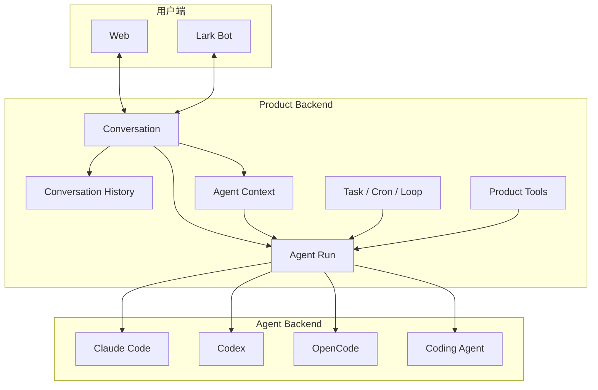
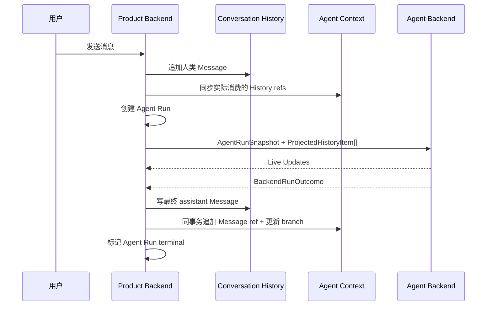

# 系统总览

本页描述系统的**目标架构**。Product Backend 拥有用户和产品能够依赖的事实；Agent Backend 负责执行 Agent 工作，但其内部 session、transcript、compaction 和 sub-agent 状态不是产品事实。

系统必须允许同一套 Product Backend 快速接入 Claude Code、Codex、OpenCode 或自研 Agent 引擎。更换执行引擎不应重写 Conversation、Task、Cron、Loop、Web 或 Lark 的业务逻辑。

## 一句话模型

```text
Product Backend 保存 History 和 Context，创建并提交 Agent Run。
Agent Backend 执行 Run，产生 Live Updates 和 outcome。
Coding Agent 是其中一个 Agent Backend。
```

## 容器视图



## 稳定概念

### Product Backend

Product Backend 拥有：

- Agent 定义、Conversation、成员、Task、Cron、Loop；
- Conversation History：多人共享对话的事实；
- Agent Context：一个 Conversation 中一个 Agent Member 的语义上下文与分支事实；
- Context Branch 与 Agent Run；
- Product Tools 的权限、审批和审计；
- 面向 Web、Lark 和 API 的 Live Updates。

Product Backend 不实现 Claude Code、Codex 或 OpenCode 的内部模型循环，也不解释其私有 transcript、compaction 或 sub-agent 状态。

### Agent Run

Agent Run 是 Product Backend 的持久执行对象。它固定 Agent、Context Branch、Agent Backend、model/config snapshot，并拥有 running、waiting、commit_failed 和 terminal 状态。

Product Backend 保证同一 Context Branch 最多一个 active Run，维护 normal、steer、follow-up 输入，并在 terminal 时原子提交最终 Message 和 Context 变化。

Execution session 的查找、resume、close、crash recovery 和 live-handle cache 都是 Agent Run 实现细节，不进入领域模型。

### Agent Backend

Agent Backend 是执行 Agent Run 的可替换引擎。Claude Code、Codex、OpenCode 和 Coding Agent 都实现同一协议。

每个 Backend 接收 Agent Run snapshot 和线性 Agent Context，产生 Live Updates 与唯一 outcome。Backend 不拥有 Conversation History 或 Agent Context，也不能决定产品终态提交。

### Agent Backend 内部

每个执行引擎可自由拥有 execution session、模型循环、原生工具、compaction、retry 和 sub-agent。这些状态都可丢弃；Agent Context 才是跨 Backend 可恢复的历史事实。

## 两类历史

### Conversation History：共享会话事实

保存所有成员可见的共享内容，并为 Web、Lark 和 API 提供统一历史顺序。人类和 Agent 的最终可见 Message 都进入 Conversation History。

### Agent Context：Agent 上下文事实

每个 `(conversationId, agentMemberId)` 有独立 Context。它保存该 Agent 实际消费的共享 Message 引用、Product Tool 结果、私有语义、Summary 和 Context Branch。

Product Backend 从 active Context Branch 构造线性 `ProjectedHistoryItem[]` 交给 Agent Backend；Backend 不读取 Context 的内部结构。

## Agent Context 是唯一可恢复历史

```text
Agent Context = canonical context history
execution session = disposable cache
```

每个 Context Branch 固定一个 Agent Backend。Fork 默认继承，也允许新 branch 显式选择另一个 Backend。

Execution session ID、同步 entry、revision 和状态属于内部 cache metadata。完全匹配时可以 resume；否则从 Agent Context 重建。

## 一次 Agent Run 的主流程



Live Updates 不写 Agent Context。只有 terminal `BackendRunOutcome` 才允许 Product Backend 原子提交最终 Message、Context ref 和 Agent Run 终态；`suspended` 保留同一个 Agent Run。

`Product Policy` 是 Product Backend 的确定性配置与纯规则集合，用来决定默认同步窗口、token budget 和 summary 触发阈值。它不依赖具体 Agent Backend。

## 上下文同步与渐进加载

Agent 被触发时，Product Backend 查询尚未消费、对该 Agent 可见的 History entries，并按统一消息数量或 token budget 同步最近历史。

更早历史通过 Product History Tool 渐进读取；只有显式 retain 才把 Message ref 追加到 Agent Context。

## Product Summary

Product Summary 由统一策略生成并写入 Agent Context。它改变发送给 Backend 的输入，但不删除原始历史。Agent Backend 内部 compaction 只是可丢弃 cache。

## 工具边界

Agent Backend 自己执行文件、Shell、搜索、浏览器等原生工具。Conversation、Task、Memory、Artifact、审批等 Product Tools 由 Product Backend 执行并拥有权限、身份、幂等和审计。

Backend 可以通过 MCP 或原生 tool protocol 调用 Product Tools；transport 不改变 Tool 的领域身份。

## Live Updates 与能力

Product Backend 暴露稳定 Live Updates。Backend 独有信息使用 `backend.<kind>.*`，产品业务不能依赖私有事件。Backend 必须明确声明真实能力，缺失能力走明确 fallback 或 unsupported。

同一 Context Branch 不允许并发 Agent Run。Agent Backend 内部可以自由唤醒 sub-agent，因为它们属于一个 Agent Run 的内部实现。

## 不变量

1. Conversation History 是共享会话事实。
2. Agent Context 是单 Agent Member 的 canonical context history。
3. Execution session 是可丢弃、可重建的缓存。
4. 一个 Context Branch 固定一个 Agent Backend。
5. 同一 Context Branch 同时最多一个 active Agent Run。
6. Live Updates 不进入 canonical history；terminal outcome 才提交最终 Message。
7. History Message 与 Context ref 在同一数据库事务中提交。
8. Model 只看到 active branch 的线性输入，不读取 Context 结构。
9. Product Tool 权限与审批由 Product Backend 统一控制。
10. Terminal outcome 是 Agent Run 完成的唯一依据。

## 关联页面

- [事实与投影](./foundations/facts-and-projections.md)
- [后端总览](./backend/overview.md)
- [Agent Context](./agents/context.md)
- [Agent Backend](./execution/agent-backend.md)
- [Conversation History](./conversation/history.md)
- [Web 消息端到端](./flows/e2e-web-message.md)
